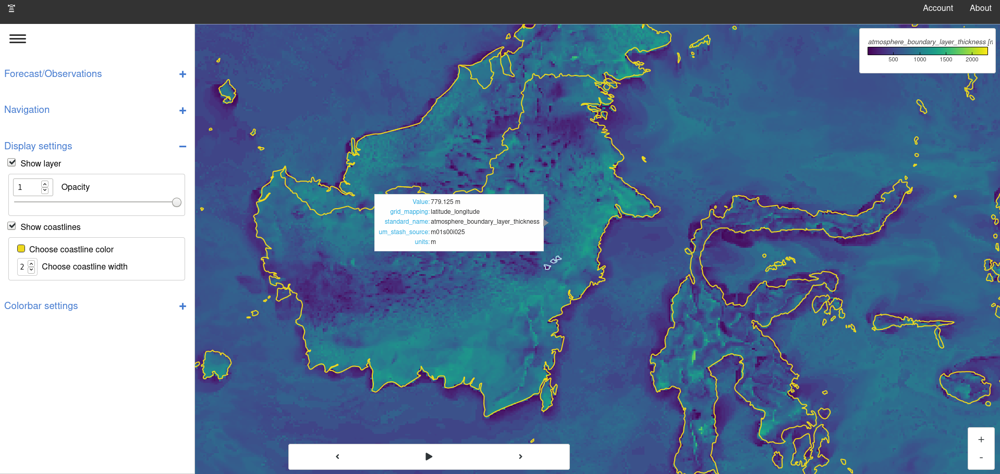
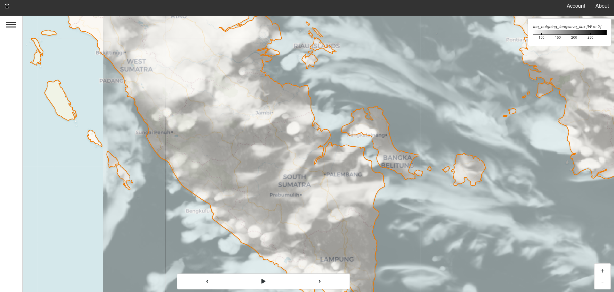

# Introduction

FOREST - **F**orecast **O**bservation **R**esearch **E**xploration and **S**urvey **T**ool

`forest_lite` is a visualisation tool for Earth science data. It
supports two common workflows; either investigate a
file locally or compare multiple collections of data.



*Above: FOREST-Lite displaying South-east Asia 4.4km model*

## Open a file

To quickly display a single file use the `open` command. This
will start a server and open a browser tab with your data
on display.

```sh
forest_lite open ${name_of_file}
```

!!! note
    `forest_lite` uses the iris driver by default.
    For alternative drivers please use the `--driver` flag


## Compare multiple datasets

Exploring a file locally can be convenient
but sometimes a more useful approach may be
to treat collections of data as single entities. In the context of Earth science such a collection
could be an atmospheric simulation or observations from an
observing network. As long as there are dimensions to support
navigation, e.g. pressure level, time, parameter etc., then a user
can explore it.


### Generate a config file

Init is a helper program to bridge the
gap between using the `open` command and the `run`
command which requires a config file. Think of it as
a helpful assistant who can write your config file for you.

```sh
forest_lite init
```

Run the command and then follow the step-by-step on screen instructions
to generate a basic configuration file.

For example, the following
configuration file loads files matching `*.nc` into a dataset
named `'My Dataset'`.

```yaml
datasets:
- label: My Dataset
  driver:
    name: iris
    settings:
      pattern: '*.nc'
```

This is of course a very simple config file but it illustrates
the format nicely. More complicated files can be reduced down
to lists of the above syntax.

### Start an instance

FOREST-Lite is a configurable system that can interface with
arbitrary data sources. It does this by defining drivers that
interpret user input and respond with data.

```sh
forest_lite run ${config_file}
```

!!! note
    Use `--no-open-tab` if running in a non-interactive environment

### Screenshot

Example of an instance running in the cloud pointing at
1.5km unified model data.



*Above: Instance displaying Indonesia 1.5km model with a slight opacity
and a custom color coastline*

## Source code

FOREST Lite source code is available at [GitHub](https://github.com/MetOffice/forest-lite).

